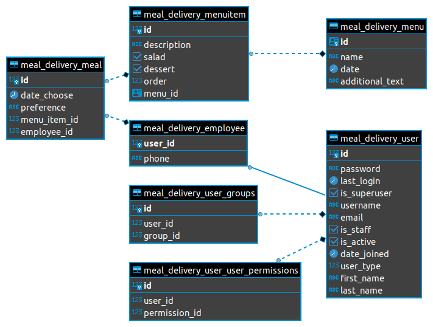

# Cornershop's Backend Test 

## Running

```
python manage.py runserver
```

### Envvars
For the correct execution remember to initialize the following environment variables ([example.env](cornershop-backend-test/example.env)):

```
POSTGRES_DEFAULT_DB=[db-name]
POSTGRES_DEFAULT_USER=[db-user]
POSTGRES_DEFAULT_PASSWORD=[db-pass]
POSTGRES_DEFAULT_HOSTNAME=[db-host]

DEBUG=true

CELERY_BROKER_URL=[redis-url]
CELERY_RESULT_BACKEND_URL=[redis-url]

SLACK_TOKEN=xoxb-[token]
SLACK_CHANNEL=[channel]

MENU_URL=[host]

HOUR_LIMIT_SELECT_MEAL=[limit-hour]
```

## Additional documentation

### Swagger 2.0

OpenAPI file for the API ([swagger](docs/Corner.Swagger20.json))

### Postman collection

Postman collection file for the API ([postman](docs/Corner.postman_collection.json))

### ER Diagram
Diagram of the database created:


